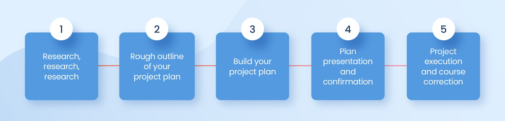

<h1>Project Planning</h1>

## Introduction

Software manager is responsible for planning and scheduling project development. They manage the work to ensure that it is completed to the required standard. They monitor the progress to check that the event is on time and within budget. The project planning must incorporate the major issues like size & cost estimation scheduling, project monitoring, personnel selection evaluation & risk management. To plan a successful software project, we must understand:

- Scope of work to be completed
- Risk analysis
- The resources mandatory
- The project to be accomplished
- Record of being followed

## Project Planning

Software Project planning starts before technical work start. The various steps of planning activities are:

## References

- [Project Planning - Java T Point](https://www.javatpoint.com/software-project-planning)
- [Invgate](https://blog.invgate.com/how-to-ensure-your-project-planning-is-successful)
